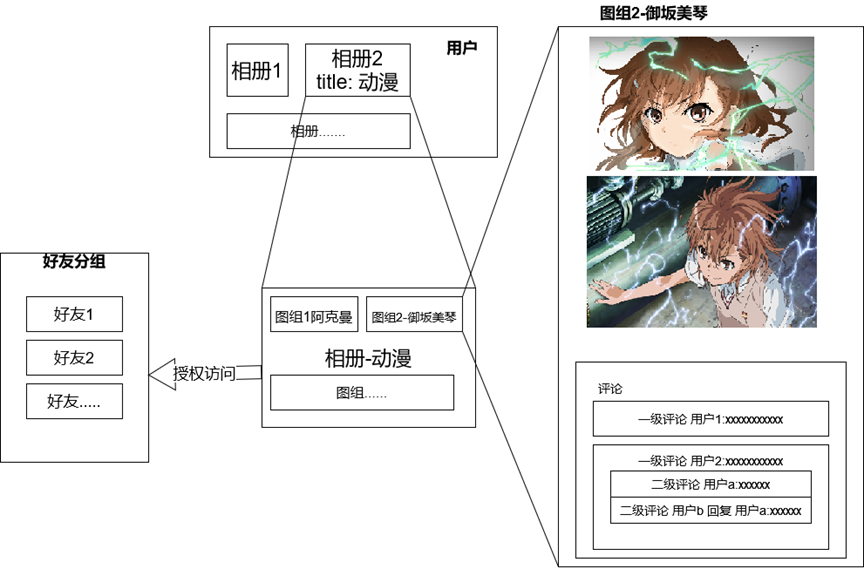

# QiaoPictureDepot - 云相册 (后端)
前后端分离的云相册系统
## 技术栈
* Spring Boot
* Spring MVC
* Spring Security
* Mybatis
* Redis
## 前端项目
[Gitee: https://gitee.com/qiao712/QiaoPictureDepot-Web](https://gitee.com/qiao712/QiaoPictureDepot-Web)
[GitHub: https://github.com/Qiao712/QiaoPictureDepot-Web](https://github.com/Qiao712/QiaoPictureDepot-Web)
## 整体功能:

* 图片二级分类管理(相册、图组)
* 好友
* 二级评论
* 相册权限管理(公开与分享)

## TODO:
* sql语句 中对 update_time 的更新
* service 事务
* controller 返回值修改
* 规范异常
* 更改认证方式
* 更改授权方式：提取出对象的拥有者字段owner_id.使用一个注解验证对象的owner_id是否与当前用户相同.